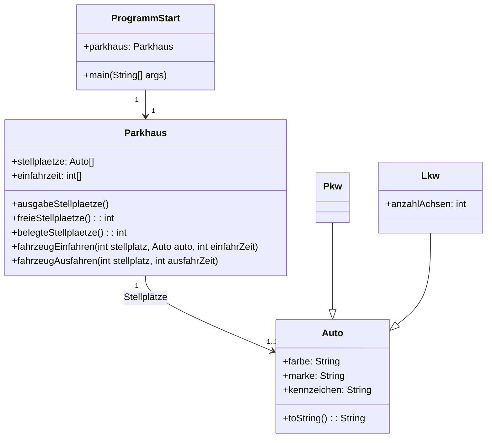

# Objektorientiertes Parkaus Beispiel

## Klassendiagramm

```mermaid
classDiagram
    class ProgrammStart {
        +parkhaus: Parkhaus
        +main(String[] args)
    }

    class Parkhaus{
        +stellplaetze: Auto[]
        +einfahrzeit: int[]
        +ausgabeStellplaetze()
        +freieStellplaetze(): int
        +belegteStellplaetze(): int
        +fahrzeugEinfahren(int stellplatz, Auto auto, int einfahrZeit)
        +fahrzeugAusfahren(int stellplatz, int ausfahrZeit)
    }

    class Auto{
        +farbe: String
        +marke: String
        +kennzeichen: String
        +toString(): String
    }

    class Pkw{
    }

    class Lkw{
        +anzahlAchsen: int
    }

    ProgrammStart "1" --> "1" Parkhaus
    Parkhaus "1" --> "1..100" Auto: Stellplätze

    Pkw --|> Auto
    Lkw --|> Auto
```