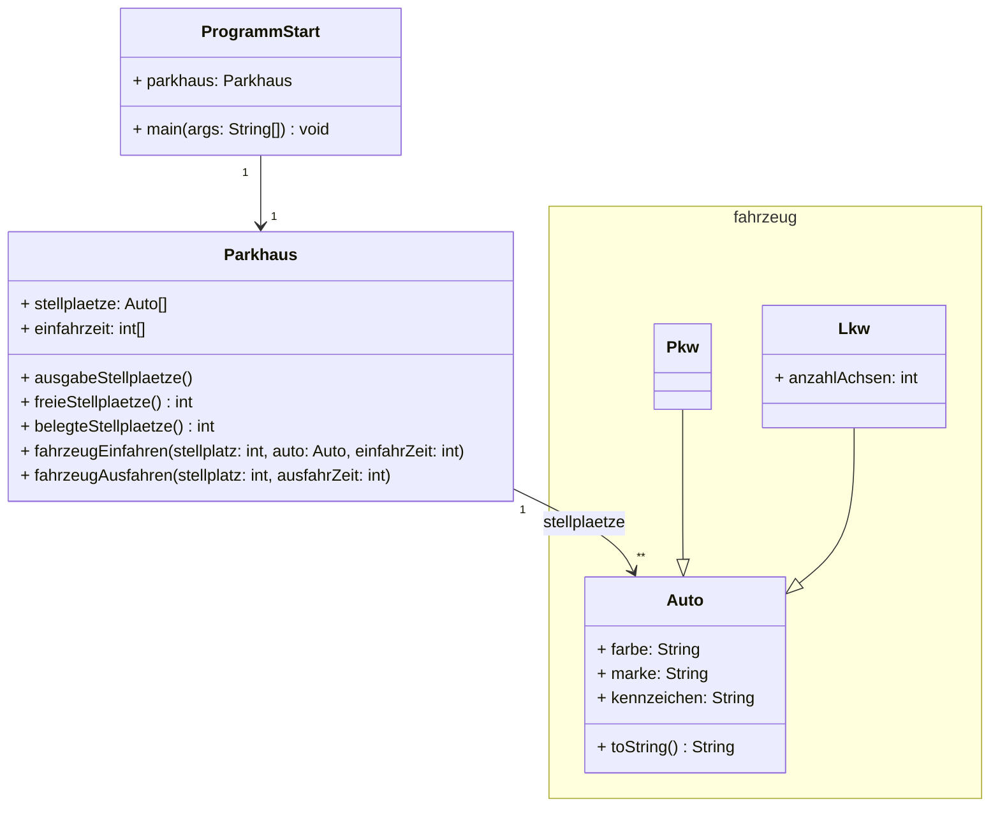

# Objektorientiertes Parkaus Beispiel

## Klassendiagramm

```mermaid
classDiagram
    class ProgrammStart {
        + parkhaus: Parkhaus
        + main(args: String[]) void
    }

    class Parkhaus{
        + stellplaetze: Auto[]
        + einfahrzeit: int[]
        + ausgabeStellplaetze()
        + freieStellplaetze() int
        + belegteStellplaetze() int
        + fahrzeugEinfahren(stellplatz: int, auto: Auto, einfahrZeit: int)
        + fahrzeugAusfahren(stellplatz: int, ausfahrZeit: int)
    }

    namespace fahrzeug {
        class Auto{
            + farbe: String 
            + marke: String 
            + kennzeichen: String
            + toString() String
        }

        class Pkw{
        }

        class Lkw{
            + anzahlAchsen: int
        }
    }

    ProgrammStart "1" --> "1" Parkhaus
    Parkhaus "1" --> "**" Auto: stellplaetze

    Pkw --|> Auto
    Lkw --|> Auto
```